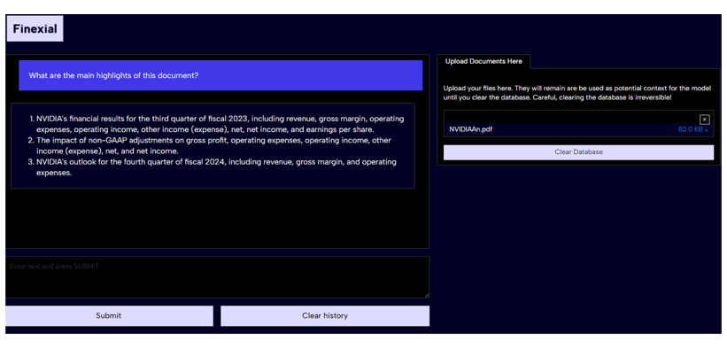

### Finexial is an AI-powered tool designed to help non-financial employees make the most of their financial data and feel more confident working with large financial reports.

# Empowering Non-Financial Employees with AI: Introducing Finexial

In today's data-driven business landscape, the ability to interpret and leverage financial information is becoming increasingly crucial. By 2025, companies expect 70% of their employees to heavily rely on data for decision-making. However, a significant gap exists between this expectation and reality. While financial data influences most business decisions, only 30% of employees from non-financial departments feel confident in their ability to understand and use this information effectively. This lack of data and financial literacy is estimated to cost US companies over $100 billion annually.
To address this pressing issue, I'm excited to introduce Finexial, an innovative AI-powered tool I developed as part of the Hack AI Dell and Nvidia challenge. As someone passionate about bridging the gap between technology and practical business needs, I created Finexial to empower employees from non-financial departments to navigate and utilize financial data with confidence.

**Finexial harnesses the power of Retrieval Augmented Generation (RAG) to revolutionize how employees interact with financial documents and reports.** By allowing users to query complex financial reports using natural language, Finexial breaks down barriers and makes financial data accessible to everyone, regardless of their background in finance.

Download Finexial and [Nvidia AI Workbench](https://www.nvidia.com/en-gb/deep-learning-ai/solutions/data-science/workbench/) following Finexial's [GitHub](https://github.com/AmandineFlachs/finexial) repository instructions, upload your documents and start querying. Finexial processes these queries, drawing insights from the uploaded document and presenting clear, concise answers. It's like having a financial analyst at your fingertips, ready to break down complex information into digestible insights.

### Privacy and Accessibility: Core Principles of Finexial
In developing Finexial, I prioritized two critical aspects: privacy and accessibility.

**Privacy**: Recognizing that many enterprises are cautious about using AI tools due to data security concerns, Finexial is designed to operate locally by default. This means the vector database used for Retrieval Augmented Generation and the inference process run on your local machine. No documents or data are shared with third parties, ensuring your sensitive financial information remains secure. For those needing additional computational power, there's an option to run inference in the cloud using Nvidia Cloud endpoint.

**Accessibility**: To make AI accessible to non-technical users, Finexial heavily relies on Nvidia AI Workbench to manage AI development environments. Finexial also uses Nvidia's Llama3-ChatQA-1.5-8B, a non-gated model, which means users do not need to request any authorization before downloading and using the model. I also used prompt engineering techniques to optimize the model for financial queries.

### Portential Impact of Finexial
By democratizing access to financial insights, Finexial stands to transform how non-financial employees engage with critical business data. Here's how:

- Increased Confidence: Employees can now approach financial documents without intimidation, fostering a culture of data-driven decision-making across all departments.
- Time Efficiency: Instead of spending hours poring over complex reports, team members can quickly extract relevant information, streamlining processes and enhancing productivity.
- Better Cross-Departmental Communication: With a shared tool for interpreting financial data, collaboration between financial and non-financial teams becomes smoother and more effective.
- Reduced Costs: By addressing the $100 billion problem of financial illiteracy in companies, Finexial can contribute significantly to cost savings and improved financial performance.
- Empowered Decision-Making: With easier access to financial insights, employees at all levels can make more informed, data-backed decisions, aligning their actions more closely with company financial goals.

### Looking Ahead
While Finexial represents a significant step forward in making financial data more accessible, it's just the beginning. Future developments could include:

- Enhanced model performance through continuous evaluation and fine-tuning.
- Exploration of smaller models for broader hardware compatibility and/or distillation.
- Expanded capabilities to handle a wider range of financial document formats, including complex spreadsheets and tables.

### A Journey of Learning and Perseverance
I have been working with tech startups since I was 18. While I do have some technical understanding, I am not a developer and have worked on my coding skills through projects like Finexial using Nvidia AI Workbench examples as guides. Another challenge I faced was related to hardware limitations. Initially, I attempted to build Finexial on an Nvidia RTX 2080 Ti, only to discover it wasn't sufficient. This roadblock could have been discouraging, but thanks to the support from the AI community on Discord and Twitter and my partner, I quickly identified the issue. I then managed to borrow an RTX 3090, which provided the necessary computational power. 

As we move towards a future where data literacy is not just an advantage but a necessity, tools like Finexial will play a crucial role in bridging the knowledge gap and empowering employees across all sectors of a business.
In conclusion, Finexial demonstrates the transformative potential of AI in democratizing financial knowledge within organizations. By making complex financial data accessible and understandable to all employees, we're not just solving a $100 billion problem – we're paving the way for a more informed, efficient, and financially savvy workforce. As businesses continue to evolve in our data-driven world, tools like Finexial will be indispensable in ensuring that every employee, regardless of their background, can contribute meaningfully to their company's financial success.
