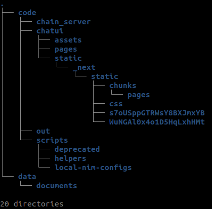

# Finexial 
### Finexial is an AI-powered tool designed to help non-financial employees make the most of their financial data and feel more confident working with large financial reports.

## Project summary

Companies expect 70% of their employees to heavily use data to make decisions by 2025, a jump of over 40% since 2018 (Tableau, 2021). Still, 74% of employees report feeling overwhelmed when working with data (Accenture, 2020). While a majority of business decisions are influenced by financial data, only 30% of employees from non-financial departments feel confident in their ability to understand and use financial information effectively (Deloitte, 2021). In the USA only, the lack of data and financial literacy is estimated to cost companies over $100B per year (Accenture, 2020).

Finexial is an AI project created for the [HackAI - Dell and NVIDIA Challenge](https://hackaichallenge.devpost.com) and is designed to help employees from non-financial departments make the most of their financial data and feel more confident working with large quantities of data-heavy documents. Finexial relies on a Large Language Model (LLM) and Retrieval Augmented Generation (RAG) to allow users to query their financial documents and reports using natural language.

## Repository

The following files are included in the repository

## Set up and run Finexial

Finexial has been designed to be both easy to run and to use thanks to [Nvidia AI Workbench](https://www.nvidia.com/en-gb/deep-learning-ai/solutions/data-science/workbench/). It relies on the non-gated [nvidia/Llama3-ChatQA-1.5-8B](https://build.nvidia.com/nvidia/chatqa-1-5-8b) model to dialogue with your documents.

### Follow the steps to set up Finexial:
* Install and configure [Nvidia AI Workbench](https://www.nvidia.com/en-gb/deep-learning-ai/solutions/data-science/workbench/) locally and open AI Workbench [(see the documentation for more info)](https://docs.nvidia.com/ai-workbench/user-guide/latest/overview/introduction.html). NVIDIA AI Workbench is a free client application that handles Git repositories and containers and manages AI development environments. 
* Fork this repository into your own GitHub account.
* Inside Nvidia AI Workbench:
    * Click ``CLONE PROJECT`` and enter the GitHub repository URL of your newly-forked repo.
    * Nvidia AI Workbench will automatically clone the repo and build out the project environment, which can take a while to complete.
    * In the Environment tab, add your own token (key) in the Secret section for both the ``HUGGING_FACE_HUB_TOKEN`` and ``NVCF_RUN_KEY``. You will need to create a free account respectively on [Hugging Face](https://huggingface.co) and [NVIDIA NGC](https://ngc.nvidia.com/signin) even if you plan to use Finexial locally.
    * Still in the Environment tab, click on ``START ENVIRONMENT``.
    * Then click on ``START CHAT`` to launch the application. A new tab in your web browser will automatically open. 

You are now ready to go!

## How to use Finexial

Now that the system is set up, you can run Finexial:
1. Choose your inference mode (local or cloud endpoint).
2. Click on the button ``START FINEXIAL``.
3. Upload your document(s).
4. Use the chat box to ask questions about the reports and documents uploaded using natural language. At any time you can start again from scratch by clearing your chat history (``CLEAR HISTORY`` button). You can also remove the uploaded document(s) by clicking on the ``CLEAR DATABASE`` button.

### Example
Let's try Finexial with [Nvidia's official Financial Results for Q3 2024](https://nvidianews.nvidia.com/news/nvidia-announces-financial-results-for-third-quarter-fiscal-2024).

### Hardware requirements for local inference

While there are no hardware requirements for cloud inference, if you are running Finexial locally you will need to ensure you have sufficient GPU resources. For this project, I used an Nvidia RTX 3090. 

## How it works

    
# License
This project is under the Apache 2.0 License.

This project may download and install additional third-party open source software projects. Review the license terms of these open source projects before use. Third party components used as part of this project are subject to their separate legal notices or terms that accompany the components. You are responsible for confirming compliance with third-party component license terms and requirements. 

